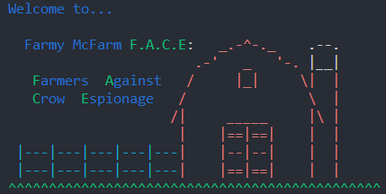
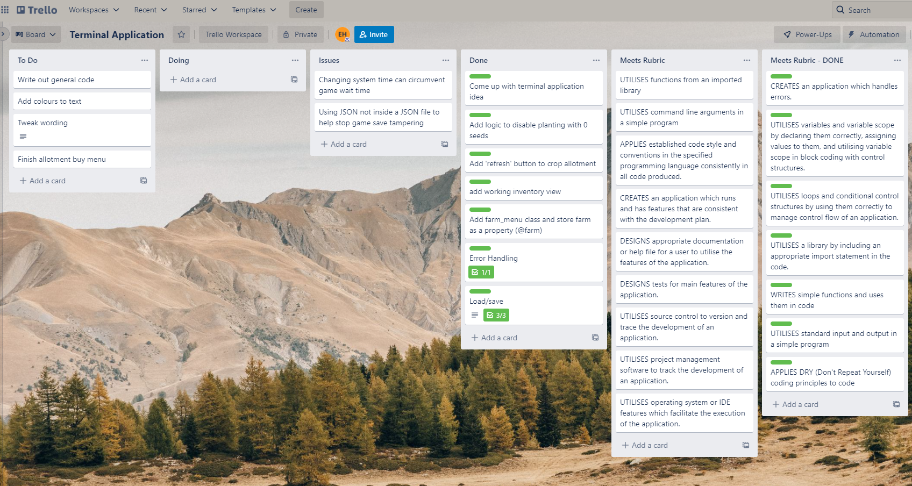
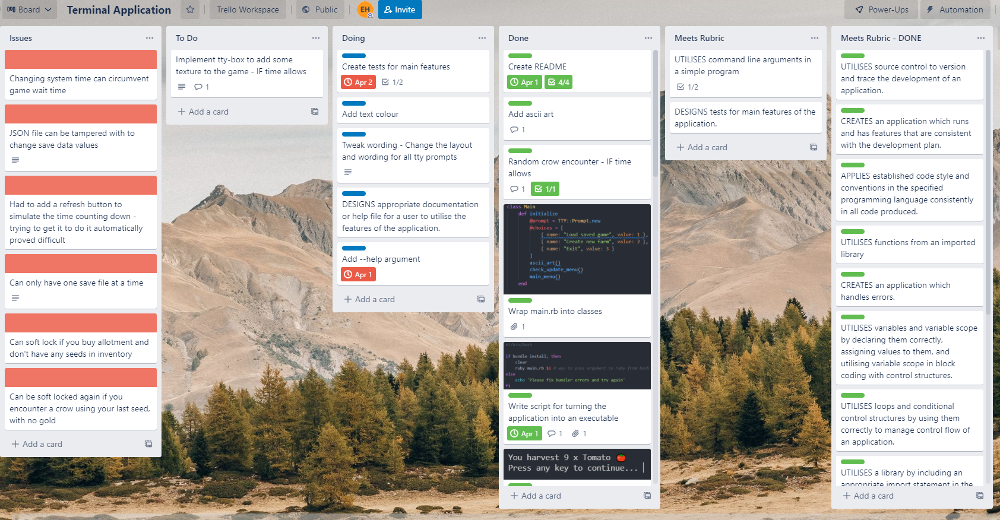

# Farmy McFarm F.A.C.E: Farmers. Against. Crow. Espionage
---
## About

Farmy McFarm Face is a simple, yet enjoyable, terminal farming simulator game. It allows you to plant and harvest your crops, all while trying to avoid those pesky crows.

---
## How to play

The game begins by either creating a new game or by loading a previous save if one is available. Creating a new game will overwrite any previous saved data. A new game will begin with a small intro (if you wish, it can be skipped using `ctrl + c` in the terminal), and after you select your farm and farmers name you'll be able to begin planting!

The game allows you to plant a seed of your choice (currently 3 types available) and harvest your produce after it has grown. But be warned, the crows are committed to eating all of your seeds, so make sure you have a little extra gold saved up, just in case.

Once a seed has grown and it says it is ready, you can then harvest it, giving you a random amount of produce which is stored in your inventory. When you have harvested your crops, you can then head on over to the store and sell your hard earned produce. Your gold will be updated and you can now go and purchase more seeds, or if you have enough gold you can purchase additional allotments.

---

## Main Features

- Planting seeds:
    - There are currently 3 different types of seeds you can choose from, tomato, corn and carrot. Each have different buy prices and growth times.

- Harvesting produce:
    - Any seed that becomes fully grown will allow you to harvest the produce. Each type of produce has a different modifier, allowing you to obtain more of one than the other.

- Buying seeds/Selling produce:
    - There is a shop menu that will allow you to sell any harvested produce and with enough gold, allow you to buy additional seeds. 

- Buy allotment:
    - Once you have sold enough produce and obtained enough gold, there is an option to unlock additional allotments to plant seeds in. The price of each allotment will increase in cost, depending on how many allotments you currently have.

- Load/save game:
    - The game will automatically save for piece of mind and the load game option will become available from the main menu. 

---
## Installation instructions

Downlaod the ZIP file directly [here](https://github.com/ehall28/terminal-application/archive/refs/heads/master.zip) or click on the green code button at the top of this page, selecting download ZIP. Once downloaded you will need to extract/unzip the files and run the program through the terminal of your choice. To run the application type `./run.sh` into the terminal to begin. Running this script will ensure all the gems needed to run this program have been downloaded.    

### Command line arguments

Commands need to be written in the terminal.

- -c or --cheats: Enables cheats that remove the wait time on crop growth (however, does not stop the crows)  
- -h or --help: Will print to screen a small list of instructions and help documentation  

e.g., `./run.sh -h`

---
## Dependencies

Farmy McFarm FACE is written entirely in the programming language Ruby (3.1.1), which will require you to have it [installed](https://www.ruby-lang.org/en/documentation/installation/) to run the application.  

The application also uses the following gems:

- [tty-prompt (~> 0.23.1)](https://github.com/piotrmurach/tty-prompt)
- [rainbow (~> 3.1)](https://github.com/sickill/rainbow)
- [date](https://ruby-doc.org/stdlib-3.1.1/libdoc/date/rdoc/Date.html)
- [time](https://ruby-doc.org/stdlib-3.1.1/libdoc/time/rdoc/Time.html)
- [json](https://ruby-doc.org/stdlib-3.1.1/libdoc/json/rdoc/JSON.html)  

These gems will be installed automatically when using `./run.sh` in the terminal to start the application. 

---
## System/hardware requirements

This application will run on most devices and operating systems, assuming that ruby is installed correctly.    

It is not necessary, but highly recommended to use a dark terminal theme, as the colours of the text will display easier. Also ensure that your terminal size is at least 20 lines long for the best experience, this can be checked easily by typing in `tput lines` into your terminal.

---

Throughout the development of this application I used a Trello board to plan out each step and thought process, which can be viewed [here](https://trello.com/b/d1aHxYDY/terminal-application).

